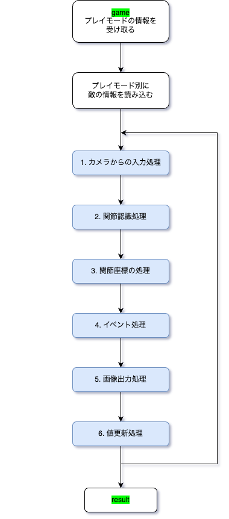
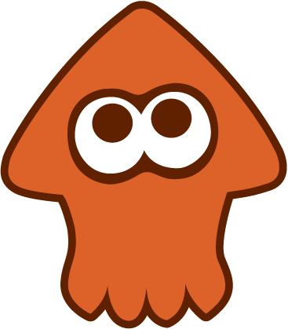

# Hand Shooter

<p align="center">
    
</p>

## How to play

```shell
python main.py
```


## Directory

```
│  game.py      # ゲーム画面
│  home.py      # ホーム画面
│  main.py      # メイン処理
│  result.py    # リザルト画面
│
├─ src          # 画像素材
│   ├─ background
│   ├─ button
│   ├─ ...etc
│
├─ stage        # 敵キャラ情報
│   ├─ 0            # easy
│   ├─ 1            # normal
│   └─ 2            # hard
│
└─ utils        # 関数
    │  game_utils.py
    │  home_utils.py
    └─ image_utils.py
```


## Requirements

- Python3
- MediaPipe
- OpenCV
- numpy


## Technical point

- 毎フレーム計算を行って画像を合成することで、滑らかなゲーム画面を実現している
- 細かく関数に分割することで、処理の流れが分かりやすいコードになっている。これによって拡張性の高い構造になっている

### home画面


- ホーム画面はゲームをプレイする際に一番最初に目にする画面なので、第一印象でこのゲームが魅力的であると感じてもらえるように工夫を凝らした
- UIの素材を事前に画像として作っておくことで、リッチな表現かつ軽量な処理を実現している
- 動きのある背景を作ることで、退屈しないホーム画面を実現した
- 背景とタイトルの色をそれぞれ５色のパターンからランダムで選んでいる。よって色の組み合わせが全部で25種類ある。これにより、ゲームを立ち上げるたびに変化を感じられるので、何度遊んでも退屈しないホーム画面を実現した

<table>
    <tr>
        <td></td>
        <td></td>
        <td></td>
        <td></td>
    </tr>
</table>

- 一枚の「イカ」の素材画像をリサイクルすることで省データ化を実現した

<table>
    <tr>
        <td></td>
        <td></td>
        <td></td>
        <td></td>
        <td></td>
    </tr>
</table>

- アニメーションは画像行列を折り返すことで素材を動かしている
- 現在選択されているプレイモードが直感的に分かるように、UIの遷移を行っている
- プレイモードの選択は「←」「→」「Return」のシンプルなキー操作で行える


### game画面

- 毎フレームごとの処理が多く複雑になるので、段階に分けて整理している（具体的な処理の流れは後述）
- 「カメラが起動できない」「手が画面内に無い」などの例外が起きた場合にもゲームが落ちないように例外処理を施している

- home画面で選択したプレイモードに従って、敵キャラのデータを変えて難易度を変更している
- 敵キャラのデータは事前に用意したjsonファイルを読み込んでいる。これにより、プログラムを変更する必要なく、ゲームバランスの調整ができる
- jsonファイルに敵キャラのデータを複数種類用意することで、毎回ランダムな配置の敵と戦えるので退屈しない
- 敵キャラは色やサイズ、速度、動き方、初期配置のパラーメータを持っており、これらをカスタマイズすることで自由度の高いステージを作成できる
- 様々なパラメータを持った敵キャラを用意することで、賑やかで変動性が高いゲーム画面を構成できる
- 敵キャラは色ごとにパラメータをある程度拘束している。この色は「この色は強そう・弱そう」という感覚的な指標に合うように選んでいる。こうすることでプレイヤーに「このキャラは強いだろうから、狙えば大きなリターンが得られる」などと言った共通認識を持ってもらうことができる

|  |  |  |
| :---: | :---: | :---: |
| easy | normal | hard |

- 人差し指の角度情報から射撃判定を行っている
- 人差し指の延長線上で、指の先端から指の長さの定数倍離れた場所に照準される。この照準位置には常にレティクルが表示されているので、直感的に狙いを定めることができる
- 一つ前のフレームのデータを保持しておくことで、射撃判定や照準位置を正確に計算している


- 射撃後、0.5秒待ってから着弾するように実装している。これにより、射撃感が高まるのに加え、ターゲットを狙って打つ難しさが増すのでゲーム性が高まる
- 射撃後、0.8秒間は射撃できない。これにより連射を防いでゲーム性を高めている
- 着弾すると、その地点に銃痕（インク痕）が表示される。これは0.3秒間継続される。これにより、どこに着弾したか視覚的に確認できる
- 敵に命中した場合は、敵を撃たれたパターンの素材に変えることで、命中を視覚的に確認できる


- ゲームに制限時間を設けている
- 現在のスコアが表示されている。スコアが加算された場合には、何点加算されたかが分かるように表示している。こうすることで、「どのキャラが点数高いか・コスパがいいか」を把握できるようになるので、戦略を立てることができる
- スコアに応じてランクを付けることで、ゲームの目標が明確になり、ゲーム性を高めることができている
- 制限時間内であっても、エスケープキーを押すことで強制終了できる


### game画面の処理フロー

1. カメラからの入力処理

        カメラからの入力を取得する。もしカメラからの入力がない場合は例外処理を行う。
        画像データはBGR形式で取得されるため、RGB形式に変換する。

2. 関節認識処理

        手の骨格を認識し、その座標を取得する。
        処理は take_coordinates() で行う。
        得られた関節の座標は keypoints に格納される。

3. 関節座標の処理

        関節座標をもとに、射撃判定・命中判定を行う。
        この処理では、一つ前のフレームの関節座標を利用するので、そのデータが無い場合は初期化処理を行う。
        関節座標が取得できていない場合は、init_flag を True にして初期化する。
    
4. イベント処理

        関節座標の処理結果に応じて、画像に描画する内容を変更する。
        行うイベント処理は以下の通り。

        - 射撃した場合に"Shot!"と表示する
        - 着弾した場合には"Bang!"と表示して、銃痕を描画する
        - 命中した場合には"Hit!"と表示して、的を爆発させる
        - それ以外の場合は、通常の的を表示する

5. 画像出力処理

        画面に必要な画像を合成して、画像を出力する。

6. 値更新処理

        次のフレームに向けて、値を更新する。


### result画面

- 背景はhome画面と共通の関数を使っている。home画面でランダムに決定した色の組み合わせと同じになるように実装している
- 数字やランクの文字を事前に素材画像として用意しておくことでリッチな表現を実現している
- スコアの桁数に応じて文字列の長さが変わるので、これに応じて配置をずらすことでUIの中心が常に画面の中心と揃うように調整している


## flow

| main | game |
| :---: | :---: |
|  |  |

## Color

### title, button
-  `#D84C8D`
-  `#F9FF5C`
-  `#81D059`
-  `#2F22DB`
-  `#9C2BF6`

### ink
-  `#EA3BEC [234, 59, 36]` 
-  `#812DF5 [129, 45, 245]` 
-  `#EAF866 [234, 248, 102]` 
-  `#0101ED [1, 1, 237]` 
-  `#74F8FD [116, 248, 253]` 
-  `#EA8743 [234, 135, 67]` 
-  `#BFE34F [191, 227, 79]` 
-  `#FFFFFF [255, 255, 255]` 


## Target
| target | score | size | speed |
| :---: | :---: | :---: | :---: |
|  | 100p | 100 | 10 |
|  | 150p | 120 | 15 |
|  | 200p | 80 | 25 |
|  | 300p | 80 | 35 |
|  | 500p | 60 | 20 |
|  | 1,000p | 50 | 25 |


## Credit

- サムネ素材館
https://samune-sozaikan.com/
